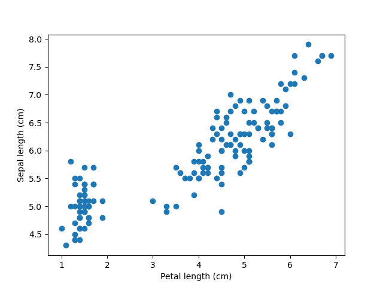
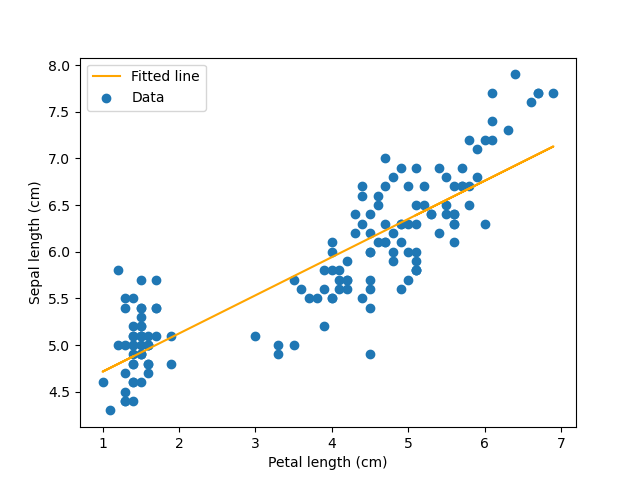

# Learning goals

1. Learn how to install Python packages.
2. Get familiar with three popular Python packages for working with, analyzing,
   and plotting data.

# Contents

-   [Getting set up](#getting-set-up)
-   [Installing Python packages](#installing-python-packages)
-   [Learning how to use the packages](#learning-how-to-use-the-packages)
-   [The exercise](#the-exercise)
-   [Acknowledgments](#acknowledgments)
-   [License](#license)


# Getting set up

At this point, you should have
(1) an account on [Github](https://github.com/) and
(2) been introduced to the very basics of [Git](https://git-scm.com/).

1.  Login to your [Github](https://github.com/) account.

1.  Fork [this repository](https://github.com/joaks1/python-tabular-data), by
    clicking the 'Fork' button on the upper right of the page.

    After a few seconds, you should be looking at *your* 
    copy of the repo in your own Github account.

1.  Click the 'Clone or download' button, and copy the URL of the repo via the
    'copy to clipboard' button.

1.  In your terminal, navigate to where you want to keep this repo (you can
    always move it later, so just your home directory is fine). Then type:

        $ git clone the-url-you-just-copied

    and hit enter to clone the repository. Make sure you are cloning **your**
    fork of this repo.

1.  Next, `cd` into the directory:

        $ cd the-name-of-directory-you-just-cloned

1.  At this point, you should be in your own local copy of the repository.

1.  As you work on the exercise below, be sure to frequently `add` and `commit`
    your work and `push` changes to the *remote* copy of the repo hosted on
    GitHub. Don't enter these commands now; this is just to jog your memory:

        $ # Do some work
        $ git add file-you-worked-on.py
        $ git commit
        $ git push origin master


# Installing Python packages

For this exercise, we will be using three popular Python packages:

<dl>
    <dt><a href="https://pandas.pydata.org/">pandas</a></dt>
    <dd>
        <a href="https://pandas.pydata.org/">pandas</a>
        is a great package for easily parsing, manipulating, and analyzing
        tabular data.
    </dd>
    <dt><a href="https://matplotlib.org/">matplotlib</a></dt>
    <dd>
        <a href="https://matplotlib.org/">matplotlib</a>
        is the most popular Python package for visualizing (plotting) data.
    </dd>
    <dt><a href="https://www.scipy.org/">SciPy</a></dt>
    <dd>
        <a href="https://www.scipy.org/">SciPy</a>
        is Python package for, well, science!
    </dd>
</dl>

`pandas`, `matplotlib`, and `scipy` are not built-in modules, like `sys`, `os`,
and `re`.
Before we use them as modules, we need to install them from external packages.

How you install Python packages will depend on the Python installation you are
using.
If you are using Python installed with
[Anaconda](https://www.anaconda.com/)
or
[Miniconda](https://docs.conda.io/en/latest/miniconda.html)
you will use the `conda` tool to install packages.
Otherwise, you will use the `pip` module to install packages.

Not sure what installation of Python you are using? No problem,
we can check.
Run this command on the command line to see the path to the Python you are
using:

    $ which python3

If `python3` is inside an `anaconda` or `miniconda` directory
(e.g., `/home/jamie/miniconda3/bin/python3`),
you will use `conda` to install packages.
If so, you can run:

    $ which conda

and that should confirm that `conda` is available in
the same directory as `python3`
(e.g., `/home/jamie/miniconda3/bin/conda`).

If `python3` is **NOT** inside an `anaconda` or `miniconda` directory
(e.g., `/usr/bin/python3`),
you will use `pip` to install packages.

## Installing packages with pip

If you are using a "normal" installation of Python (not anaconda/miniconda),
you can use the `pip` module to install packages.
To install the `pandas` and `matplotlib` packages, run this command at the
command line:

    $ python3 -m pip install scipy matplotlib pandas

## Installing packages with conda

If you are using anaconda or miniconda, you can use the `conda` tool to install
the `pandas` and `matplotlib` packages:

    $ conda install scipy matplotlib pandas

## Checking the installed packages

To verify that the packages were installed correctly,
fire-up the Python interpreter:

    $ python3

And try importing `pandas` and `matplotlib`:

```python
>>> import pandas
>>> import matplotlib
>>> import scipy
```

If you get an error when trying to import a package, then it is not installed
correctly.


# Learning how to use the packages

We will only scratch the surface of what these packages are capable of.
However, all three are very well documented, so you can refer to their online
documentation to take them further.

## Getting familiar with pandas

Let's open our Python interpreter and play around with `pandas` a bit.
Enter the lines below in the interpreter to import the pandas module and read
data from a CSV file into a `DataFrame` object:

```python
>>> import pandas as pd
>>> dataframe = pd.read_csv("iris.csv")
>>> type(dataframe)
>>> print(dataframe)
```

The output from the print statement should look like:

         sepal_length_cm  sepal_width_cm  petal_length_cm  petal_width_cm         species
    0                5.1             3.5              1.4             0.2     Iris_setosa
    1                4.9             3.0              1.4             0.2     Iris_setosa
    2                4.7             3.2              1.3             0.2     Iris_setosa
    3                4.6             3.1              1.5             0.2     Iris_setosa
    4                5.0             3.6              1.4             0.2     Iris_setosa
    ..               ...             ...              ...             ...             ...
    145              6.7             3.0              5.2             2.3  Iris_virginica
    146              6.3             2.5              5.0             1.9  Iris_virginica
    147              6.5             3.0              5.2             2.0  Iris_virginica
    148              6.2             3.4              5.4             2.3  Iris_virginica
    149              5.9             3.0              5.1             1.8  Iris_virginica
    

These are morphological data from three species of *Iris*; you can
[learn more about these data here](https://en.wikipedia.org/wiki/Iris_flower_data_set).
Notice, when we imported pandas we gave it a shorter name `pd`.
This is common practice with some Python packages.
We will adhere to this practice, because you are likely to see it
when searching the interweb for help with `pandas` and `matplotlib`.

Next, let's learn the basics of how to access the data in a `pandas`
`DataFrame`.

### Accessing columns

There are two ways to access columns of a data frame.
One is to use the "dot" syntax to access them as attributes
of the object:

```python
>>> dataframe.sepal_length_cm
```

The other is to use `dict`-like syntax to access them using
the column header as a key:

```python
>>> dataframe["sepal_length_cm"]
```

Both ways will get the same result:

    0      5.1
    1      4.9
    2      4.7
    3      4.6
    4      5.0
          ... 
    145    6.7
    146    6.3
    147    6.5
    148    6.2
    149    5.9
    Name: sepal_length_cm, Length: 150, dtype: float64


### Accessing rows

We can use `iloc` (short for index location) to access the first row of the
data frame:

```python
dataframe.iloc[0]
```

    sepal_length_cm            5.1
    sepal_width_cm             3.5
    petal_length_cm            1.4
    petal_width_cm             0.2
    species            Iris_setosa
    Name: 0, dtype: object

To access the first 3 rows we can use:

```python
dataframe.iloc[0:3]
```

       sepal_length_cm  sepal_width_cm  petal_length_cm  petal_width_cm      species
    0              5.1             3.5              1.4             0.2  Iris_setosa
    1              4.9             3.0              1.4             0.2  Iris_setosa
    2              4.7             3.2              1.3             0.2  Iris_setosa

To get the value at first row of first column, use:

```python
>>> dataframe.iloc[0, 0]
5.1
```

To get the values at first three rows of first column, you can:

```python
>>> dataframe.iloc[0:3, 0]
0    5.1
1    4.9
2    4.7
Name: sepal_length_cm, dtype: float64
```

We can get the same result of the last line using:

```python
>>> dataframe.sepal_length_cm[0:3]
```

Or:

```python
>>> dataframe["sepal_length_cm"][0:3]
```

### Filtering data

Now, let's learn how to filter out subsets of the data frame.
First, let's get a new data frame that only contains plants with flower petals
longer than 5.9 cm:

```python
>>> long_flowers = dataframe[dataframe.petal_length_cm > 5.9]
>>> print(long_flowers)
```

         sepal_length_cm  sepal_width_cm  petal_length_cm  petal_width_cm         species
    100              6.3             3.3              6.0             2.5  Iris_virginica
    105              7.6             3.0              6.6             2.1  Iris_virginica
    107              7.3             2.9              6.3             1.8  Iris_virginica
    109              7.2             3.6              6.1             2.5  Iris_virginica
    117              7.7             3.8              6.7             2.2  Iris_virginica
    118              7.7             2.6              6.9             2.3  Iris_virginica
    122              7.7             2.8              6.7             2.0  Iris_virginica
    125              7.2             3.2              6.0             1.8  Iris_virginica
    130              7.4             2.8              6.1             1.9  Iris_virginica
    131              7.9             3.8              6.4             2.0  Iris_virginica
    135              7.7             3.0              6.1             2.3  Iris_virginica

Next, let's get a new data frame with data for one *Iris* species only:

>>> versicolor = dataframe[dataframe.species == "Iris_versicolor"]
>>> print(versicolor)

        sepal_length_cm  sepal_width_cm  petal_length_cm  petal_width_cm          species
    50              7.0             3.2              4.7             1.4  Iris_versicolor
    51              6.4             3.2              4.5             1.5  Iris_versicolor
    52              6.9             3.1              4.9             1.5  Iris_versicolor
    53              5.5             2.3              4.0             1.3  Iris_versicolor
    54              6.5             2.8              4.6             1.5  Iris_versicolor
    55              5.7             2.8              4.5             1.3  Iris_versicolor
    56              6.3             3.3              4.7             1.6  Iris_versicolor
    57              4.9             2.4              3.3             1.0  Iris_versicolor
    58              6.6             2.9              4.6             1.3  Iris_versicolor
    .
    .
    .


## Plotting with matplotlib

Next, let's learn the basics of plotting with `matplotlib`.
`quit()` your previous Python interpreter session and open
a new one:

    $ python3

Import `pandas` and `matplotlib`, read the *Iris* data into a data frame, and
generate a simple scatter plot:

```python
import pandas as pd
import matplotlib.pyplot as plt
dataframe = pd.read_csv("iris.csv")
plt.scatter(dataframe.petal_length_cm, dataframe.sepal_length_cm)
plt.xlabel("Petal length (cm)")
plt.ylabel("Sepal length (cm)")
plt.savefig("petal_v_sepal_length.png")
quit()
```

You should now have a file named `petal_v_sepal_length.png` in your current
directory.
If you open this PNG file it should look like:




## Basic stats with scipy

Open your Python interpreter again:

    $ python3

Below, we will import the `stats` module of `scipy` along with `pandas` and
`matplotlib`,
run a linear regression of sepal length against petal length,
and add the regression line to our plot:

```python
import pandas as pd
import matplotlib.pyplot as plt
from scipy import stats
dataframe = pd.read_csv("iris.csv")
x = dataframe.petal_length_cm
y = dataframe.sepal_length_cm
regression = stats.linregress(x, y)
slope = regression.slope
intercept = regression.intercept
plt.scatter(x, y, label = 'Data')
plt.plot(x, slope * x + intercept, color = "orange", label = 'Fitted line')
plt.xlabel("Petal length (cm)")
plt.ylabel("Sepal length (cm)")
plt.legend()
plt.savefig("petal_v_sepal_length_regress.png")
quit()
```
You should now have another PNG file (`petal_v_sepal_length_regress.png`) that
looks like:




# The exercise

Write a Python script to perform the linear regression we did above but for
each of the three species of *Iris* separately.
Use
[best practices](https://github.com/joaks1/python-script-best-practice)
when writing your script. For example:

-   Make your code modular and reusable by breaking it up into functions.
-   Use docstrings to document your script and functions.
-   Make your script importable by using `if __name__ == '__main__'`.


# Acknowledgments

## Support
This work was made possible by funding provided to [Jamie
Oaks](http://phyletica.org) from the National Science Foundation (DEB 1656004).


# License

<a rel="license" href="http://creativecommons.org/licenses/by/4.0/deed.en_US"></a><br />This work is licensed under a <a rel="license" href="http://creativecommons.org/licenses/by/4.0/deed.en_US">Creative Commons Attribution 4.0 International License</a>.
